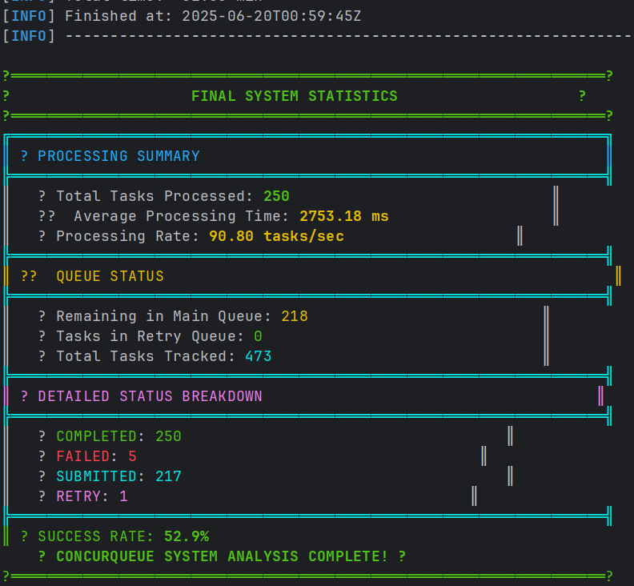
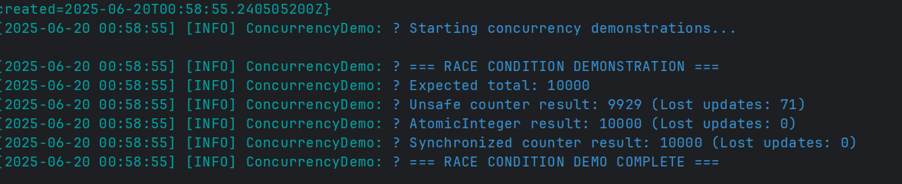

# ConcurQueueSystem - Multithreaded Job Processing Platform


ConcurQueue is  a high-performance job dispatcher system, designed to handle a large number of concurrent jobs efficiently. It is built using Java core concueeency primitives.

## Table of Contents
- [Overview](#overview)
- [Architecture & Design](#architecture--design)
- [Key Features](#key-features)
- [System Components](#system-components)
- [Getting Started](#getting-started)
- [Running the Application](#running-the-application)
- [Configuration](#configuration)
- [Concurrency Demonstrations](#concurrency-demonstrations)
- [Monitoring & Analytics](#monitoring--analytics)
- [Project Structure](#project-structure)

## Overview

ConcurQueue is a comprehensive multithreaded job processing platform designed to demonstrate and simulate concurrent concepts in real work systems. It implements a producer-consumer pattern with priority queues, retry mechanisms, and real-time monitoring.

### Demostrates
- **Concurrent Operations**: Thread pools, blocking queues, atomic operations
- **Synchronization**: Race conditions, deadlocks, volatile visibility
- **Design Patterns**: Producer-Consumer, Observer, Strategy patterns
- **Performance Monitoring**: Real-time metrics and system analysis

## Architecture & Design

### Core Architecture
```
┌─────────────────┐    ┌──────────────────┐    ┌─────────────────┐    ┌─────────────────┐
│   Producers     │───▶│  Priority Queue  │───▶│  Worker Pool    │───▶│ System Stats   │
│  (3 types)      │    │ (Thread-Safe)    │    │  (5 workers)    │    │                 │
└─────────────────┘    └──────────────────┘    └─────────────────┘    └─────────────────┘
                                │                        │
                                ▼                        ▼
                       ┌──────────────────┐    ┌─────────────────┐
                       │   Retry Queue    │◀───│  Failed Tasks   │
                       │                  │    │                 │
                       └──────────────────┘    └─────────────────┘
                                │
                                ▼
                       ┌──────────────────┐
                       │  Retry Workers   │
                       │    (2 workers)   │
                       └──────────────────┘
```

### Design Patterns Used

1. **Producer-Consumer Pattern**
    - Producers generate tasks asynchronously
    - Consumers process tasks from shared queue
    - Decoupled architecture for scalability

2. **Strategy Pattern**
    - Different producer strategies: HIGH_PRIORITY_FOCUSED, BALANCED, LOW_PRIORITY_BATCH
    - Configurable task generation patterns

3. **Observer Pattern**
    - System monitor observes queue states and performance metrics
    - Real-time status updates and reporting

## Key Features

### 🔧 **Core Functionality**
- **Priority-based Task Processing**: Tasks processed by priority (1-10 scale)
- **Fault Tolerance**: Automatic retry mechanism with exponential backoff
- **Thread Pool Management**: Configurable worker threads with proper lifecycle management
- **Real-time Monitoring**: Live system metrics and performance analytics

### 📊 **Monitoring & Analytics**
- **Live Status Display**: Real-time queue sizes, thread activity, task statistics
- **JSON Export**: System metrics exported for external analysis
- **Colored Console Output**: Enhanced readability with status-based coloring
- **Comprehensive Statistics**: Success rates, processing times, failure analysis

## System Components

### 1. Task Model
```java
public class Task implements Comparable<Task> {
    private final UUID id;
    private final String name;
    private final int priority;          
    private final Instant createdTimestamp;
    private final String payload;
    private int retryCount = 0;
    private static final int MAX_RETRIES = 3;
}
```

### 2. Producer Strategies
- **HIGH_PRIORITY_FOCUSED**: high-priority tasks (7-10), medium-priority (1-6)
- **BALANCED**: Even distribution across all priority levels (1-10)
- **LOW_PRIORITY_BATCH**:low-priority tasks (1-6),  high-priority (7-10)

### 3. Worker Types
- **TaskWorker**: Main processing workers 
- **RetryWorker**: Handles failed task retries 
- **SystemMonitor**: Performance monitoring

### 4. Queue Management
- **Main Queue**: `PriorityBlockingQueue<Task>`
- **Retry Queue**: `LinkedBlockingQueue<Task>` 
- **Status Tracking**: `ConcurrentHashMap<String, TaskStatus>`

## Getting Started

### Prerequisites
- **Java 21+** 
- **Maven 4+**
- **Terminal/Command Prompt** with ANSI color support for best experience


### Installation
```bash
# Clone the repository
git clone https://github.com/Tabari-Linus/ConcurQueue
cd ConcurQueue

# Build the project
mvn clean compile

# Package (optional)
mvn package
```

## Running the Application

### Method 1: Interactive Menu (Recommended)
```bash
# Run with Maven
./mvnw exec:java -Dexec.mainClass="lii.concurqueuesystem.ConcurQueueSystemApplication"

# Or with compiled JAR
java -jar target/concur-queue-system-1.0.jar
```

**Menu Options:**
1. **Demonstrate Synchronization Challenges** - Race conditions, deadlocks, volatile visibility
2. **Run Full Queue System (2 minutes)** - Complete system demonstration
3. **Quick System Demo (30 seconds)** - Short system overview
4. **Performance Stress Test** - Configurable load testing
5. **Deadlock Detection Demo** - Specific deadlock scenarios
6. **Thread Pool Analysis** - Thread behavior analysis
7. **Queue Behavior Analysis** - Queue dynamics study
8. **Custom Configuration** - User-defined parameters

### Method 2: Direct Execution
```bash
# Run directly for 2 minutes with concurrency demos
./mvnw exec:java -Dexec.mainClass="lii.concurqueuesystem.ConcurQueueSystemApplication" -Dexec.args="direct"
```

### Method 3: IDE Execution
1. Import project into your IDE (IntelliJ IDEA, Eclipse, VS Code)
2. Run `ConcurQueueSystemApplication.main()`
3. For direct mode: Add program argument `direct`

## Configuration

### Customization Options
- **Worker Pool Size**: Adjust number of processing threads
- **Queue Capacity**: Modify main queue buffer size
- **Producer Strategies**: Custom task generation patterns
- **Failure Simulation**: Configurable failure rates
- **Monitoring Intervals**: Real-time update frequencies

## Concurrency Demonstrations

### 1. Race Condition Demo
```java
// Demonstrates unsynchronized vs synchronized counter updates
- Unsafe counter (lost updates)
- AtomicInteger (thread-safe)
- Synchronized blocks (explicit locking)
```


### 2. Deadlock Prevention
```java
// Shows deadlock scenario and resolution
- Circular lock dependency (causes deadlock)
- Ordered locking (prevents deadlock)
- Timeout-based lock acquisition
```

## Monitoring & Analytics

### Real-time Dashboard
```
╔══════════════════════════════════════════════════════════╗
║                    ? SYSTEM STATUS MONITOR                   ║
║                  2025-06-20 00:59:05                  ║
╠══════════════════════════════════════════════════════════╣
║ ??  QUEUE STATUS                                           ║
║   Main Queue: 285    │ Retry Queue: 0               ║
╠══════════════════════════════════════════════════════════╣
║ ? THREAD POOL STATUS                                     ║
║   Active: 5   │ Core: 5   │ Max: 5   │ Completed: 0       ║
╠══════════════════════════════════════════════════════════╣
║ ? TASK STATUS BREAKDOWN                                 ║
║   Submitted: 284  │ Processing: 5    │ Completed: 183    ║
║   Failed: 0       │ Retry: 1       │ Abandoned: 0      ║
╠══════════════════════════════════════════════════════════╣
║ ? PERFORMANCE METRICS                                    ║
║   Total Processed: 183      │ Avg Time: 3021.14 ms      ║
╚══════════════════════════════════════════════════════════╝

```

### JSON Export
System automatically exports metrics to JSON files:
```json
{
   "timestamp": "2025-06-19T22:20:46.666494200Z",
   "monitor_cycle": 24,
   "queues": {
      "main_queue_size": 269,
      "retry_queue_size": 0
   },
   "thread_pool": {
      "active_threads": 5,
      "core_pool_size": 5,
      "maximum_pool_size": 5,
      "completed_task_count": 0
   },
   "task_status": {
      "submitted": 269,
      "processing": 5,
      "completed": 169,
      "failed": 0,
      "retry": 0,
      "abandoned": 0
   },
   "performance": {
      "total_processed": 169,
      "average_processing_time_ms": 2964.34
   }
}
```

## Project Structure

```
src/main/java/lii/concurqueuesystem/
├── ConcurQueueSystemApplication.java     # Main application entry point
├── consumer/
│   ├── TaskWorker.java                   # Main task processing workers
│   └── RetryWorker.java                  # Failed task retry handlers
├── producer/
│   └── TaskProducer.java                 # Task generation with strategies
├── docs/                                 # Documentation and files
├── model/
│   └── Task.java                         # Task data model with priorities
├── enums/
│   ├── TaskStatus.java                   # Task lifecycle states
│   └── ProducerStrategy.java             # Task generation strategies
├── demo/
│   └── ConcurrencyDemo.java             # Demonstration of concurrency concepts(Deadlock, Race Conditions)
├── monitor/
│   └── SystemMonitor.java               # Performance monitoring
├── logging/
│   ├── TaskLogger.java                  # Structured task logging
│   └── ColoredConsoleFormatter.java     # Enhanced console output
├── util/
│   └── DisplayFormatter.java           # UI formatting utilities
├── menu/
│   └── Menu.java                        # Interactive menu system
└── exception/
    └── TaskProcessingException.java     # Custom exception handling
```

## Advanced Features

### Graceful Shutdown
- **Producer Interruption**: Clean producer thread termination
- **Queue Draining**: Process remaining tasks before shutdown
- **Thread Pool Cleanup**: Proper resource management
- **Final Statistics**: Comprehensive shutdown report

### Error Handling
- **Task Failure Simulation**: Configurable failure rates
- **Retry Logic**: Progressive retry with delay
- **Abandonment**: Tasks exceeding retry limits
- **Exception Propagation**: Proper error reporting
- **Custom Exceptions**: TaskProcessingException for specific errors

### Performance Optimization
- **Lock-free Operations**: Atomic counters and concurrent collections
- **Thread Pool Tuning**: Optimized worker thread management
- **Priority Processing**: Higher priority tasks processed first
- **Batch Operations**: Efficient producer batch processing

### Best Practices Demonstrated
- **Resource Management**: Proper thread pool lifecycle
- **Exception Handling**: Graceful failure recovery
- **Logging**: Structured and colored output
- **Configuration**: Flexible system parameters
- **Testing**: Stress testing and edge case handling

## Troubleshooting

### Common Issues
1. **OutOfMemoryError**: Reduce queue capacity or worker pool size
2. **Thread Deadlock**: Check custom lock ordering in demos
3. **High CPU Usage**: Adjust producer intervals or batch sizes
4. **Console Colors**: Ensure terminal supports ANSI colors

